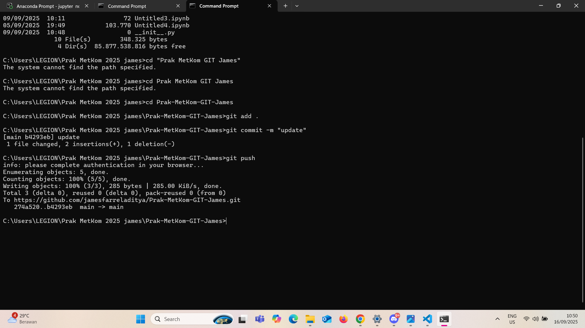
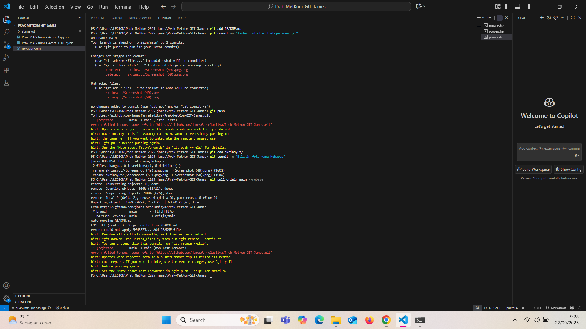

# James Metkom  
## 💌 What I Learned (alias: cerita cinta aku sama coding eaaa 💕)

> *"Aku, laptop, sama error jam 2 pagi… cinta segitiga yang nggak pernah aku lupa 😆"*  

Jadi gini... selama ngerjain praktikum ini, aku belajar BANYAK (dan sedikit jatuh cinta sama coding 🤭 gak deng chandaaa).  

- 💻 **Aku vs. Code** – Drama, nangis, ketawa, terus akhirnya happy ending pas kodenya jalan 😭✨  
- 🧠 **Otak Jadi Level Up** – Aku belajar mikir step by step biar masalahnya kebagi kecil-kecil.  
- 🎀 **Code Harus Cantik** – Bukan cuma jalan, tapi harus rapi & aesthetic (biar masa depan nggak pusing liatnya 😌).  
- 😅 **Kesabaran +999** – Debugging itu kayak meditasi… lama-lama bikin tenang (kadang 😳).  

---

### 🎀 Me When Im Coding:

  

---

### 💭 Pesan Buat Aku di Masa Depan:
Ingat ya… coding itu fun kok! (boong) Jangan lupa rasa seneng pas akhirnya kodenya jalan 🥹  
Terus bikin project-project lucu, terus belajar, dan jangan lupa tetap jadi diri sendiri yang **keren & gemesin** 💅✨  

---

### 🤯 Hal yang Masih Bikin Aku Bingung:
- Kenapa error suka muncul? 🌚  
- Kenapa `;` (titik koma) hilang bisa bikin error? 🥲  
- Apa bedanya bug, feature, sama "fitur yang kebetulan jalan"? 😅  
- Kenapa kadang code yang harusnya salah malah jalan? (spooky 👻)    

  

---

## 📸 Hasil Eksperimen Git  

**Bukti Eksperimen:**

- 
- 
- 

## Hal Yang Masih Bikin Aku Bingung PT2
- Kenapa gak keluar foto nya???????, aku udh lakukan smuaaa benerrrrr kenaffah begini ya tuhan susah kali ngecoding, susah banget ya allah mau nangys aja😭😭😭😭😭😭😭
- akhirnya bisaaaaa yeayyyyyyyy

